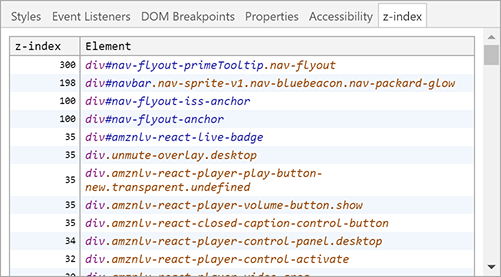
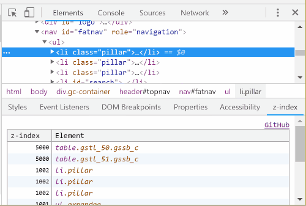
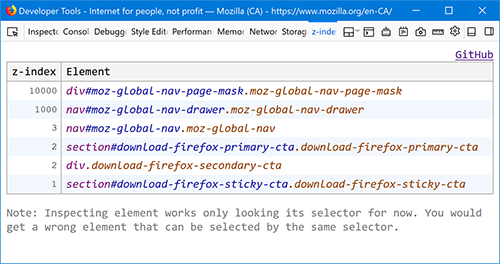

# DevTools z-index

[](https://travis-ci.org/ginpei/devtools-z-index) [](https://greenkeeper.io/)

→ [日本語の紹介記事](https://ginpen.com/2018/06/20/devtools-z-index/)

**Stop `z-index: 999999` !!**

This adds "z-index" sub-pane of Elements panel for Chrome, "z-index" panel for Firefox.

### Install

[](https://chrome.google.com/webstore/detail/bcnpmhefiohkpmjacfoanhbjhikegmoe/)
[](https://addons.mozilla.org/en-US/firefox/addon/devtools-z-index/)

## What for?

You may be shocked by finding how large numbers are used in your page. Unconsidered large numbers would be killed by another larger numbers, and those larger numbers also killed by much-larger numbers like war. That sucks.

This extension offers a table that helps reduce those numbers. You can keep your CSS code clean, maintainable and peaceful.

**No more `z-index: 2147483647` !!**

## Chrome extension

https://chrome.google.com/webstore/detail/bcnpmhefiohkpmjacfoanhbjhikegmoe/





## Firefox add-on

https://addons.mozilla.org/en-US/firefox/addon/devtools-z-index/



Since Firefox doesn't allow us to add nice Inspector (Elements) panel's pane, I added it as a panel.

## Code snippet

Basic idea was in [Twitter](https://twitter.com/ginpei_jp/status/1006312787813908480) and Gist.

https://gist.github.com/ginpei/073ab5d4679356f29585a9ae02277012

```js
((document, limit) => {
  const data = Array.from(document.querySelectorAll('*'))
    .map((el) => ({zIndex: Number(getComputedStyle(el).zIndex), element: el }))
    .filter(({ zIndex }) => !isNaN(zIndex))
    .sort((r1, r2) => r2.zIndex - r1.zIndex)
    .slice(0, limit);
  console.table(data);
})(document, 50);
```

## Future feature

Honestly, I'm not planning to update since I felt satisfied tough, it would be fun to add following features.

- Fix: it finds a wrong element when some elements have the same selector (because it searches only by selector)
- Show useful information like stacking context
- Show something if an element's z-index is specified by style attribute
- Ability to update z-index for preview, like DevTools Style sub-pane
- Set better icon somehow

## Dev

### Development for Chrome

1. Open Extensions page
   1. `chrome://extensions/`
2. Turn on "Developer mode" switch at the top right
3. Press "Load unpacked" button
4. Select `extension/` directory on this project
5. Modify code and resources, press a reload button in the Extensions page

### Publish

1. Make sure `zip` is installed
   1. `apt install zip` for WSL
2. Run `npm run build`
3. You will get a file `extension.zip` in the project root directory
4. TODO

## License

- MIT

## Contact

- Ginpei Takanashi
- Twitter [@ginpei_en](http://twitter.com/ginpei_en)
- GitHub [@ginpei](https://github.com/ginpei/) / [devtools-z-index](https://github.com/ginpei/devtools-z-index)
- [Ginpei.info](https://ginpei.info/)
