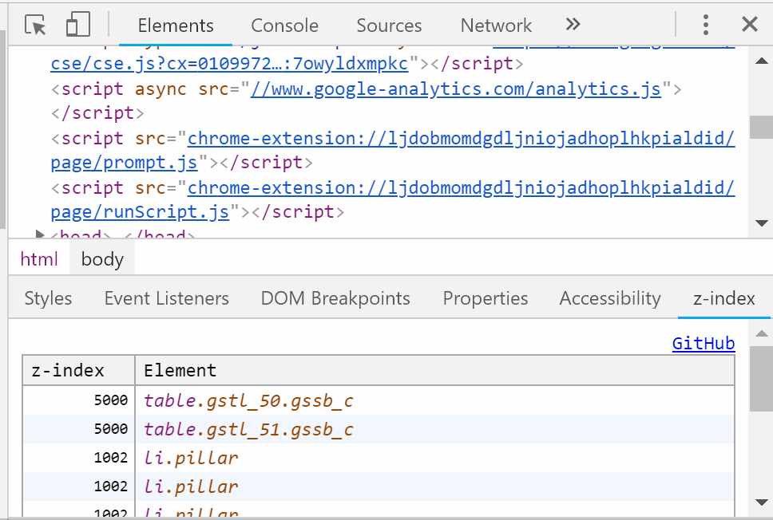

# DevTools z-index

## Chrome extension

https://chrome.google.com/webstore/detail/bcnpmhefiohkpmjacfoanhbjhikegmoe/publish-accepted

## Firefox add-on

https://addons.mozilla.org/en-US/firefox/addon/devtools-z-index/

Since Firefox doesn't allow us to add nice Elements panel's pane, I added it as a panel.

## License

- MIT

## Contact

- Ginpei Takanashi
- Twitter [@ginpei_en](http://twitter.com/ginpei_en)
- GitHub [@ginpei](https://github.com/ginpei/) / [devtools-z-index](https://github.com/ginpei/devtools-z-index)
- [Ginpei.info](https://ginpei.info/)
